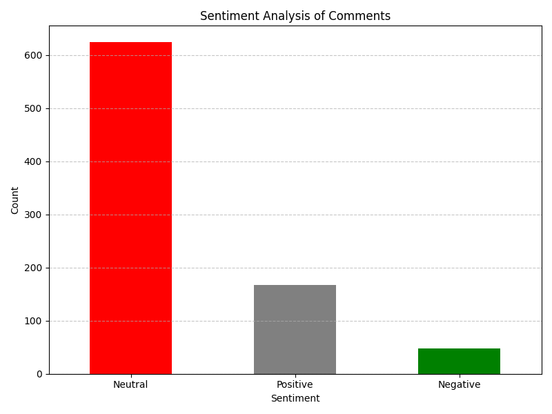

# Analisis Sentimen dan Ekstraksi Tema Utama dari Komentar Video YouTube

## Deskripsi Proyek
Proyek ini bertujuan untuk menganalisis sentimen dan mengekstraksi tema utama dari komentar pada video YouTube berjudul "ChatGPT dan Masa Depan Pekerjaan Kita." Analisis ini menggunakan pendekatan campuran, yaitu analisis kuantitatif dan kualitatif, dengan memanfaatkan teknik Natural Language Processing (NLP) untuk mendapatkan wawasan mendalam mengenai pola sentimen dan respons publik terhadap kecerdasan buatan (AI).

---

## Metode

### Jenis Analisis
Penelitian ini menggunakan pendekatan campuran:
1. Kuantitatif: Pengukuran distribusi sentimen (positif, netral, negatif) menggunakan algoritma NLP seperti VADER dan TextBlob.
2. Kualitatif: Identifikasi tema utama menggunakan Term Frequency-Inverse Document Frequency (TF-IDF).

### Teknik Analisis
1. Analisis Sentimen: Menilai sentimen komentar berdasarkan skor polaritas.
2. Ekstraksi Tema Utama: Menggunakan TF-IDF untuk mengidentifikasi kata-kata atau tema yang paling dominan.
3. Visualisasi Data: Menampilkan hasil analisis dalam bentuk grafik dan tabel untuk mempermudah interpretasi.

---

## Prosedur
1. Pengumpulan Data:
   - Data komentar diambil menggunakan YouTube Data API v3 hingga mencapai total 839 komentar.
2. Pengolahan Data:
   - Membersihkan komentar dari simbol khusus dan kata-kata tidak relevan menggunakan Natural Language Toolkit (NLTK).
   - Analisis sentimen dilakukan menggunakan VADER dan TextBlob.
3. Visualisasi Data:
   - Membuat grafik batang untuk distribusi sentimen dan tabel untuk tema utama.

---

## Teknologi yang Digunakan
- Bahasa Pemrograman: Python
- Pustaka Python:
  - NLTK
  - pandas
  - matplotlib
  - sklearn
  - textblob
  - vaderSentiment
- API: YouTube Data API v3

---

## Hasil
- Distribusi Sentimen:
  Grafik menunjukkan mayoritas sentimen komentar adalah netral, dengan proporsi sentimen positif dan negatif yang lebih kecil.
  
  

- Tema Utama:
  Kata-kata seperti "ChatGPT," "AI," dan "bisa" merupakan tema yang paling dominan dalam komentar.
- Hashtag Populer:
  Hashtag seperti #ChatGPT dan #AI sering digunakan dalam komentar.
- File CSV:
  Hasil analisis disimpan dalam file [detailed_comments_analysis.csv](detailed_comments_analysis.csv).

---

## Cara Menjalankan Proyek
1. Clone repositori ini:
      git clone https://github.com/username/repo-name.git
   
2. Instal pustaka yang diperlukan:
      pip install -r requirements.txt
   
3. Jalankan skrip utama:
      python main.py
   

---

## Daftar Pustaka
1. Hutto, C. J., & Gilbert, E. (2014). VADER: A Parsimonious Rule-Based Model for Sentiment Analysis of Social Media Text. *ICWSM-14*.
2. Mikolov, T., et al. (2013). Efficient Estimation of Word Representations in Vector Space. *arXiv preprint arXiv:1301.3781*.
3. McKinney, W. (2010). Data Structures for Statistical Computing in Python. *Proceedings of the 9th Python in Science Conference*.
4. Manning, C. D., et al. (2008). Introduction to Information Retrieval. *Cambridge University Press*.
5. Bird, S., et al. (2009). Natural Language Processing with Python. *O'Reilly Media*.

---

## Kontributor Anggota Kelompok
Berikut adalah foto anggota kelompok yang berkontribusi dalam proyek ini:

- Nama: [Nafal Mumtaz Fuadi]
- Email: [Nafalmf@gmail.com]
- Institusi: Universitas Pelita Bangsa

- Nama: [Fauji farhansyah]
- Email: [fauzii@.gmail.com]
- Institusi: Universitas Pelita Bangsa

- Nama: [Rimba wahyu soga]
- Email: [Rimba.gmail.com]
- Institusi: Universitas Pelita Bangsa

- Nama: [ALFHIN CHORRYAGNESHA AZIZ]
- Email: [apin@gmail.com]
- Institusi: Universitas Pelita Bangsa
---

## Lisensi
Proyek ini dilisensikan di bawah [MIT License](LICENSE).